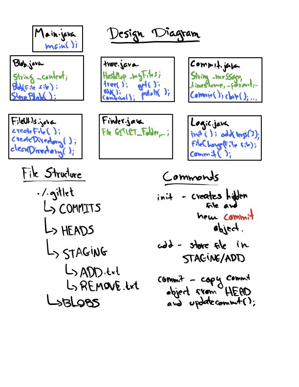

# Gitlet Design Document
author: Lucas Salim

## 1. Classes and Data Structures

### Main
The Main is the entry point of the program. After compiling, one can run
`java gitlet.Main init` to initialize our version control system. The code
consists of a switch case checking whether the first argument matches one of
the known commands. If that matches, we proceed to the logic of a given argument.

### Blob
This class is a representation of the content of a file. Here we can store the content
of the file in some other place (like another file). 

#### Fields:
* private String __contentAsString_: the string used to store the content of Blob.
* private byte[] __content_: an arrays used to store the content of Blob.

### Tree
This class is a representation of a mapping between a file name and its UID (a unique
value calculated through SHA-1). It uses the HashMap data structure to make such mapping. 

#### Fields:
* public HashMap<String, String> _myFiles_: data structure used to store a file name and its UID.

### Commit
This class is a representation of a commit. A commit consists of a combinations of 
log messages, other metadata (commit date, author, etc.), a reference to a tree, 
and references to parent commits.

#### Fields:
  * private String __message_: a message of a given commit. 
  * private tree __TreeADD_: stores the add tree of a commit.
  * private tree __TreeREMOVE_: stores the remove tree of a commit.
  * private String __parent_: stores the previous commit (parent).
  * private Date __date_: store the current date of commit.
  * private static final int _SHORTUID_: stores the short UID value.
  * private static final int _YEAR_: stores our initial year.

### Logic
A class for all the logic in our gitlet system. Here we see methods 
for all the commands arguments in the Main program.

### FileUtils
This is a class responsible for methods dealing with Files. Here we have methods to 
clean a directory, create a file, delete a file, etc.

### Finder
This is a class responsible for storing all the files and directories we will be using.

#### Fields:
* public static final File _CWD_: the current working directory
* public static final File _GITLET_FOLDER_: a hidden folder that indicates intialization
* public static final File _COMMIT_FOLDER_: the folder to store the committing tree
* public static final File _BRANCHES_FOLDER_: the folder to store all our branches.
* public static final File _CURRENT_: the folder to store the current branch.
* public static final File _MASTER_: the folder to store master branch.
* ublic static final File _MASTER_POINTER_: initially, _CURRENT_ will orignially point to master.
* public static final File _STAGING_AREA_: a folder for the staging area
* public static final File _ADD_: a file that stores the trees to be added from the staging area 
* public static final File _REMOVE_:  file that stores the trees from the staging area that are to be removed
* public static final File _BLOBS_FOLDER_: a folder for our Blobs
* public static final File[] _DIRECTORIES_: a list containing some directories above
* public static final File[] _FILES_: a list containing some files above

## 2. Algorithms
A brief discription of the most important methods for each class.

### Blob.java
1. Blob(File file): this creates a Blob for a given File FILE. 
2. storeBlob(): this stores our instance in file with name consisting of the hash code (sha-1) of our Blob. The file is stored in directory BLOBS_FOLDER and contains _content.

### tree
1. tree(): this creates a tree object. It creates a new HashMap for _myFiles.
2. add(File file): Put File FILE inside our _myFiles.
3. contains(File file): returns true if and only if _myFiles contains FILE.
4. get(File file): returns Blob for given File FILE.
5. putAll(tree tree): combine this tree with tree TREE. 

### Commit
1. Commit(): this creates the initial commit. It assigns its fields with the corresponding value for a initial commit and stores the commit in COMMITS_FOLDER.
2. Commit(String message, tree tree): create new commit with a given message and some tree TREE. 
3. Commit clone(Commit c): Returns a copy of commit C. 
4. updateCommit(String message, tree tree): This updates our commit to have new message MESSAGE and new tree TREE. 
5. clearStagingArea(): clear the STAGING directory by emptying the ADD and REMOVE files. 
6. storeCommit(): stores our commit in COMMIT_FOLDER. It also sets the HEADER pointer; that is: it stores the ID (sha-1 hash) of this commit in the HEADS folder.

### Logic
1. init(): creates a new Gitlet version-control system. The method creates the hidden GITLET_FOLDER and the required directories and files. It also creates a new commit object. 
2. add(String[] args): Add the arguments (files) to the Staging Area (STAGING_AREA) if and only if the files were new or modified.
3. fileChanged(File file): returns true if and only if File FILE was modified (that is; the previous commit have a different copy of FILE or FILE is new).
4. commit(String[] args): Saves the files in the STAGING_AREA to a new commit with some message that is represented by ARGS[1]. 

### FileUtils
1. createFile(File file): Creates the file for a given FILE.
2. createFiles(File... files): Creates the directory for a given FILE (that represents some directory). No error if already exists.
3. createDirectory(File file, String message): Creates the directory for a given FILE (that represents some directory). Throw GitletException for a given MESSAGE.
4. createDirectory(File file): Creates the directory for a given FILE (that represents some directory). No error if already exists.
5. createDirectories(File... files): Creates the directory for a given FILE (that represents some directory). No error if already exists.
6. cleanDirectory(File filepath): Erase all files on directory in FILEPATH.

## 3. Persistence
Let us start by running`java gitlet.Main init`. After that, our program will create a hidden file called .gitlet that has the following subdirectories:
* COMMITS
* HEADS
* BLOBS
* STAGING
  * ADD (file inside STAGING)
  * REMOVE (file inside STAGING)
  
Then an initial commit will be stored inside COMMITS and HEADS (with its name being the sha-1 hash for its own object).
Suppose we have in our current working directory a file named "wug.txt" and we want to add that to the staging area of gitlet by running
`java gitlet.Main add wug.txt`. We then store the tree containing the file name an the 
file blob inside STAGING/ADD by writing the tree ID (again, using sha-1 hash) into the ADD file. 
After running `java gitlet.Main commit -m “modify wug.txt”`, we create a copy of our HEAD commit and modify its message
and its tree. The tree now contains the wug.txt version stored in STAGING/ADD and after we store our commit in 
COMMITS, and update our commit head in HEADS, we delete the content of STAGING/ADD.

## 4. Design Diagram

